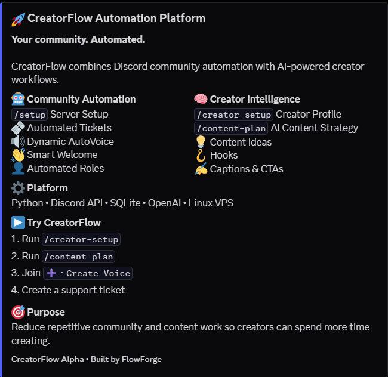
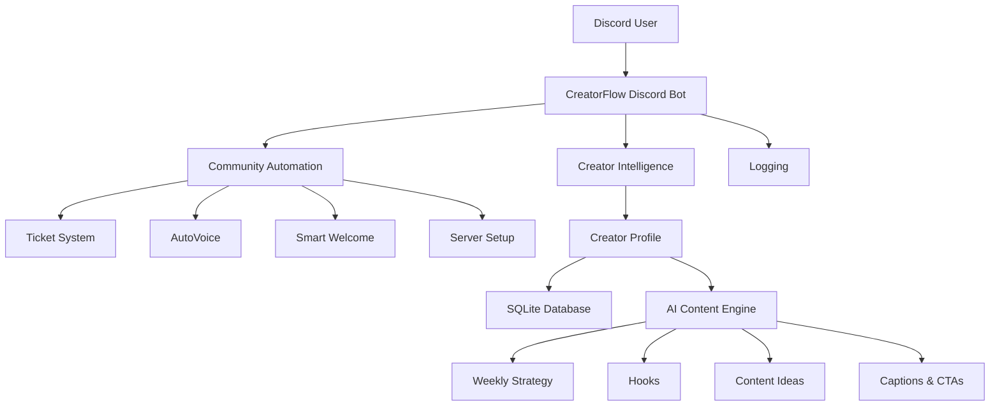
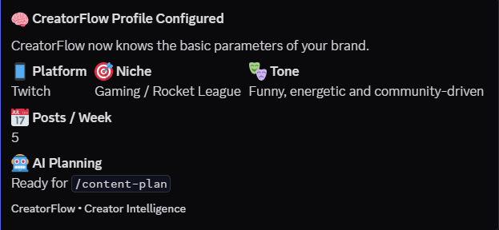
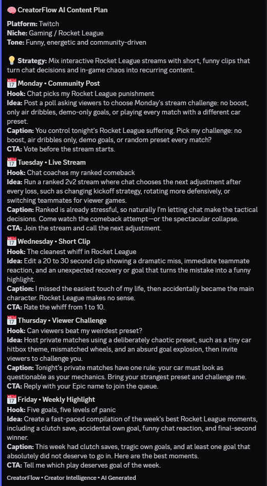
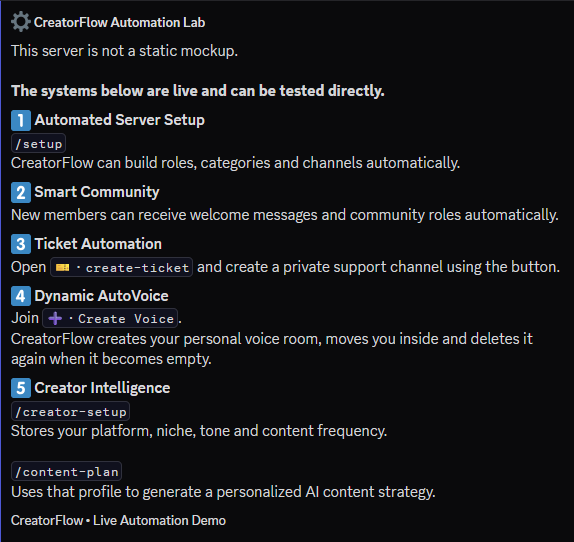
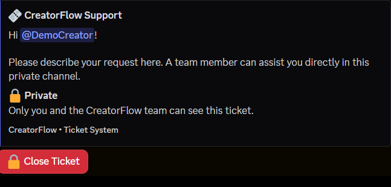
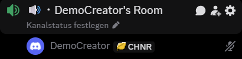
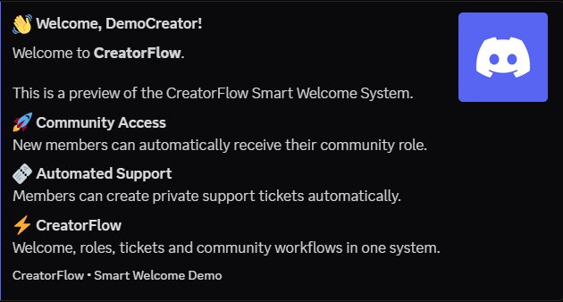

# 🚀 CreatorFlow

### Discord Community Automation + AI Creator Workflows

**CreatorFlow** is a modular creator automation platform built with Python that combines Discord community management with AI-powered creator workflows.

> **Less repetitive work. More time for creating.**
<br>

<p align="center">
  
</p>

<p align="center">
  <strong>Discord Community Automation + AI Creator Workflows</strong>
</p>

<br>
CreatorFlow demonstrates how Discord automation, persistent data, APIs, and AI can be connected into one practical system for creators and online communities.

---

## ✨ Features

### 🤖 Community Automation
- Automated Discord server setup
- Button-based ticket system with private support channels
- Smart welcome workflows
- Automatic community roles
- Dynamic AutoVoice channels
- Automatic cleanup of empty voice rooms
- Slash-command based management

### 🧠 Creator Intelligence
- Persistent creator profiles
- Platform, niche, tone, and content-frequency settings
- AI-generated weekly content strategies
- Hooks, content ideas, captions, and calls to action
- Local fallback content planning when the external AI service is unavailable

### 🗄️ Persistent Data
CreatorFlow uses SQLite to persist creator profiles and automation state, allowing workflows to use stored creator information instead of treating every command as an isolated request.

---

## 🧠 AI Content Workflow

```text
Creator Setup
     ↓
Persistent Creator Profile
     ↓
CreatorFlow AI
     ↓
Weekly Content Strategy
     ↓
Hooks • Ideas • Captions • CTAs
```

Example:

```text
/creator-setup

Platform: Twitch
Niche: Gaming / Rocket League
Tone: Funny, energetic and community-driven
Posts / Week: 5
```

Then:

```text
/content-plan
```

CreatorFlow reads the saved profile and generates a personalized weekly content strategy.

---

## 🎫 Ticket Automation

```text
Create Ticket
     ↓
Private Support Channel
     ↓
Automatic Permissions
     ↓
Creator + Staff Access
     ↓
Close Ticket
```

---

## 🔊 Dynamic AutoVoice

```text
Join "Create Voice"
        ↓
Personal Voice Room Created
        ↓
User Automatically Moved
        ↓
Room Becomes Empty
        ↓
Channel Automatically Deleted
```

---

## 👋 Smart Welcome

New community members can automatically receive:
- Personalized welcome messages
- Community access information
- Community roles
- Support information
- CreatorFlow onboarding guidance

A preview workflow is included for demonstration purposes.

---

## 🛠️ Technology

- Python 3
- discord.py
- Discord API
- OpenAI API
- SQLite
- AsyncIO
- Linux / Ubuntu VPS
- Environment-based configuration

---

## 🏗️ Architecture



---

## 💬 Slash Commands

```text
/help
/setup
/profile
/roadmap
/changelog
/ticket-panel
/welcome-preview
/creator-setup
/content-plan
/demo
/showcase-setup
```

---

## 🚀 Demo Environment

CreatorFlow includes a dedicated Discord showcase environment where the automation systems can be tested directly, including:
- Community automation overview
- Creator Intelligence
- AI content planning
- Ticket workflow
- Dynamic AutoVoice
- Smart Welcome
- Creator profile configuration

---


Diesen Abschnitt löschen wir komplett.

Stattdessen:

```markdown
## 📸 CreatorFlow in Action

### 🚀 Automation Platform

CreatorFlow combines Discord community automation with AI-powered creator workflows.


---

### 🧠 Persistent Creator Profiles

Creators configure their platform, niche, tone and publishing frequency. CreatorFlow stores this configuration and uses it throughout the automation workflow.



---

### 🤖 AI Content Planning

CreatorFlow uses the stored creator profile to generate personalized content strategies, including hooks, content ideas, captions and calls to action.



---

### ⚙️ Live Automation Lab

The demo server provides a live environment for testing CreatorFlow's community and creator automation systems.



---

### 🎫 Automated Support Tickets

Members can create private support channels with automated permissions and a complete close-ticket workflow.



---

### 🔊 Dynamic AutoVoice

Joining the Create Voice channel automatically creates a personal voice room and moves the user into it.



---

### 👋 Smart Welcome

CreatorFlow provides automated onboarding, welcome messages and community role workflows for new members.


```

---

## 🎬 Product Demo

A full CreatorFlow product demonstration has been produced in 1080p60.

The public demo link will be added here.

---

## ⚙️ Installation

Clone the repository:

```bash
git clone YOUR_REPOSITORY_URL
cd CreatorFlow
```

Create and activate a virtual environment:

```bash
python3 -m venv venv
source venv/bin/activate
```

Install dependencies:

```bash
pip install -r requirements.txt
```

Create your local environment configuration:

```bash
cp .env.example .env
```

Configure the required values in `.env`:

```env
DISCORD_TOKEN=YOUR_DISCORD_BOT_TOKEN
OPENAI_API_KEY=YOUR_OPENAI_API_KEY
OPENAI_MODEL=YOUR_MODEL
```

Start CreatorFlow:

```bash
python bot.py
```

---

## 🔐 Security

Secrets are never stored directly in the public source code. Runtime and private files such as `.env`, API keys, Discord bot tokens, databases, logs, virtual environments, backups, and deployment-specific private files are excluded from version control.

**Never commit production credentials to a repository.**

---

## 🗺️ Project Status

**CreatorFlow Alpha**

Current milestone:
- ✅ Core architecture
- ✅ Discord server automation
- ✅ Ticket automation
- ✅ Dynamic AutoVoice
- ✅ Smart Welcome
- ✅ Creator profiles
- ✅ Persistent SQLite data
- ✅ AI content planning
- ✅ AI fallback system
- ✅ Demo environment
- ✅ Product demo

Future development may include analytics, scheduled creator workflows, additional API integrations, and extended automation modules.

---

## 👨‍💻 Built by FlowForge

FlowForge builds practical automation systems for creators, online communities, and small businesses.

Focus areas:
- Discord automation
- Python development
- AI workflows
- API integrations
- Creator automation
- Linux VPS deployment

---

## 📄 Portfolio Notice

CreatorFlow is presented as a portfolio and demonstration project showcasing practical experience with Discord automation, Python application architecture, APIs, databases, AI integrations, and Linux deployment.

© 2026 FlowForge
